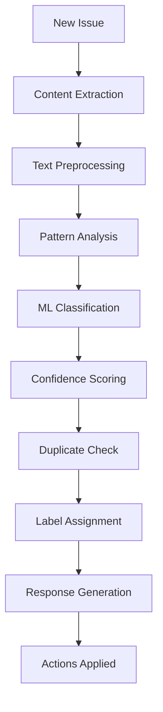

# 🤖 Issue Auto-Manager System

A comprehensive automated issue management system for GitHub repositories that uses machine learning and intelligent analysis to process, categorize, and manage issues automatically.

## 🌟 Features

### 🔍 **Intelligent Issue Analysis**
- **ML-powered Classification**: Automatically categorizes issues as bugs, features, questions, or documentation
- **Confidence Scoring**: Provides confidence levels for classifications
- **Content Quality Assessment**: Evaluates completeness and identifies missing information
- **Keyword Extraction**: Identifies important terms and concepts
- **Sentiment Analysis**: Detects user sentiment for priority scoring

### 🔄 **Advanced Duplicate Detection**
- **TF-IDF Vectorization**: Uses machine learning for semantic similarity detection
- **Cosine Similarity**: Calculates precise similarity scores between issues
- **Smart Thresholds**: Configurable similarity thresholds for different actions
- **Multiple Match Detection**: Finds and ranks multiple potential duplicates
- **Context-Aware**: Considers both title and body content

### 🏷️ **Automated Labeling & Responses**
- **Smart Auto-Labeling**: Applies appropriate labels based on analysis
- **Welcome Messages**: Sends contextual welcome messages to issue reporters
- **Template Responses**: Uses dynamic templates based on issue type
- **Missing Info Requests**: Automatically requests additional information when needed
- **Professional Tone**: Maintains helpful and professional communication

### ⏰ **Stale Issue Management**
- **Activity Monitoring**: Tracks issue activity and age
- **Graduated Warnings**: Progressive notifications before closure
- **Configurable Timelines**: Customizable stale and auto-close periods
- **Exception Handling**: Respects special labels and maintainer overrides
- **Cleanup Automation**: Keeps issue tracker organized

## 🚀 Quick Setup

### 1. **Copy Files to Your Repository**

```bash
# Copy the workflow files
.github/workflows/
├── issue-auto-manager.yml          # Basic JavaScript-based automation
├── advanced-issue-manager.yml      # ML-powered Python automation

# Copy the Python scripts
scripts/
├── advanced_issue_manager.py       # Main ML-based issue processor
├── stale_issue_processor.py        # Stale issue management

# Copy configuration
.github/
├── issue-manager-config.yml        # Configuration file
```

### 2. **Configure Labels**

Create these labels in your GitHub repository (Settings → Labels):

```yaml
# Type Labels
- name: "bug"
  color: "d73a4a"
  description: "Something isn't working"
  
- name: "enhancement" 
  color: "a2eeef"
  description: "New feature or request"
  
- name: "question"
  color: "d876e3"
  description: "Further information is requested"

# Automation Labels  
- name: "auto-processed"
  color: "0e8a16" 
  description: "Processed by automation"
  
- name: "needs-more-info"
  color: "fbca04"
  description: "Requires additional information"
  
- name: "potential-duplicate"
  color: "ffc649"
  description: "May be duplicate of another issue"
  
- name: "stale"
  color: "ffffff"
  description: "Issue is stale and may be closed"
  
- name: "keep-open"
  color: "0052cc"
  description: "Prevent automated closure"
```

### 3. **Enable GitHub Actions**

The workflows will automatically activate when you push them to your repository. No additional configuration needed!

## ⚙️ Configuration

### **Basic Configuration**

Edit `.github/issue-manager-config.yml` to customize behavior:

```yaml
# Duplicate Detection
DUPLICATE_THRESHOLD: 0.85          # How similar issues must be to flag as duplicate
SIMILARITY_THRESHOLD: 0.75         # Threshold for potential duplicate warning

# Timing  
STALE_DAYS: 30                     # Days before marking as stale
AUTO_CLOSE_DAYS: 7                 # Days after stale before auto-close

# Features
AUTO_RESPONSE_ENABLED: true        # Send welcome messages
DUPLICATE_CHECK_ENABLED: true     # Check for duplicates
ML_ANALYSIS_ENABLED: true         # Use machine learning analysis
```

### **Advanced Configuration**

Customize response templates, keywords, and ML parameters in the config file.

## 🔧 How It Works

### **When an Issue is Opened:**

1. **Content Analysis** 📊
   - Extracts and preprocesses issue content
   - Identifies keywords and patterns
   - Calculates content quality metrics

2. **Type Classification** 🎯
   - Uses pattern matching and ML to determine issue type
   - Assigns confidence scores to classifications
   - Identifies missing information for bug reports

3. **Duplicate Detection** 🔍
   - Vectorizes issue content using TF-IDF
   - Compares against existing open issues
   - Calculates cosine similarity scores
   - Flags potential duplicates above threshold

4. **Automated Actions** ⚡
   - Applies appropriate labels
   - Sends contextual welcome message
   - Requests additional info if needed
   - Notifies about potential duplicates

### **Ongoing Management:**

- **Stale Detection**: Monitors issue activity
- **Progressive Warnings**: Sends stale notices before closure  
- **Automated Cleanup**: Closes inactive issues
- **Maintainer Override**: Respects manual labels and preferences

## 📊 Issue Analysis Process



## 🎛️ Customization Options

### **Response Templates**

Customize automated responses in the config file:

```yaml
RESPONSES:
  BUG_WELCOME: |
    🐛 **Thank you for reporting this bug!**
    
    Your issue has been automatically analyzed:
    - Type: Bug Report
    - Confidence: {confidence}%
    - Priority: {priority}/5
    
    What happens next?
    - Our team will investigate this issue
    - Updates will be posted here
```

### **Classification Keywords**

Adjust keyword sets for better classification:

```yaml
BUG_KEYWORDS:
  - "error"
  - "crash" 
  - "exception"
  # Add your specific terms
```

### **ML Parameters**

Fine-tune machine learning settings:

```yaml
ML_CONFIG:
  VECTORIZER:
    MAX_FEATURES: 1000
    NGRAM_RANGE: [1, 2]
  SIMILARITY:
    THRESHOLD: 0.75
```

## 🛡️ Privacy & Security

- **No Data Storage**: Issues are processed in memory only
- **GitHub API Only**: Uses standard GitHub API calls
- **Token Permissions**: Requires only `issues:write` permission
- **Open Source**: All code is transparent and auditable
- **Configurable**: All automation can be disabled/customized

## 📈 Benefits

### **For Maintainers:**
- ✅ **Reduced Manual Work**: Automated triaging and labeling
- ✅ **Better Organization**: Consistent labeling and categorization  
- ✅ **Cleaner Issue Tracker**: Automated stale issue management
- ✅ **Faster Response**: Immediate acknowledgment of new issues
- ✅ **Quality Control**: Requests missing information automatically

### **For Contributors:**
- ✅ **Immediate Feedback**: Quick responses to submitted issues
- ✅ **Clear Guidance**: Told exactly what information is needed
- ✅ **Duplicate Prevention**: Notified about similar existing issues
- ✅ **Professional Experience**: Consistent, helpful communication

## 🔧 Troubleshooting

### **Common Issues:**

**Labels not being applied:**
- Ensure labels exist in your repository
- Check GitHub Actions permissions
- Verify configuration syntax

**Duplicate detection not working:**
- Check if Python dependencies are installed
- Verify similarity thresholds in config
- Ensure sufficient issue history exists

**Responses not sending:**
- Check for rate limiting
- Verify response templates are valid
- Ensure `AUTO_RESPONSE_ENABLED` is true

## 📝 Example Workflows

### **Bug Report Processing:**
1. User submits bug report
2. System analyzes content and detects missing steps
3. Auto-labels as `bug` and `needs-more-info`
4. Sends welcome message requesting reproduction steps
5. Monitors for response and removes `needs-more-info` when updated

### **Duplicate Detection:**
1. User submits new issue
2. System compares against existing issues using ML
3. Finds 87% similarity with existing issue #123
4. Labels as `potential-duplicate`
5. Comments with link to similar issue
6. Maintainer reviews and closes if confirmed duplicate

### **Stale Issue Management:**
1. Issue inactive for 30 days
2. System adds `stale` label and warning comment
3. No activity for additional 7 days
4. Issue automatically closed with explanation
5. User can reopen by removing stale label and adding activity

## 🤝 Contributing

Want to improve the issue auto-manager? 

1. Fork the repository
2. Make your changes
3. Test with your own issues
4. Submit a pull request

## 📄 License

This issue management system is open source and free to use in any GitHub repository.

---

🤖 **Happy Issue Managing!** This system will help keep your repository organized and provide great user experience for issue reporters.
