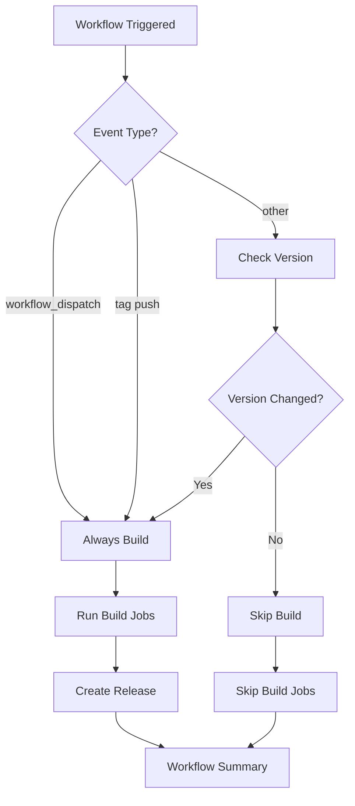

# Release Automation Guide

## Overview

The PDF Utility project now includes an enhanced automated release system that creates GitHub releases based on the version number in `pdf_utility_build_config.json`. This system prevents unnecessary builds and ensures releases are only created when the version changes.

## How It Works

### Version-Based Build Control

1. **Version Check Job**: At the start of every workflow run, the system reads the `version` field from `pdf_utility_build_config.json`
2. **Release Comparison**: Compares the current version with the latest GitHub release tag
3. **Build Decision**: Only proceeds with building if:
   - Version has changed since the last release
   - This is a manual workflow dispatch (always builds)
   - This is a tag push (always builds)

### Workflow Jobs

```
check-version → configure → build → create-release → workflow-summary
      ↓             ↓         ↓           ↓              ↓
   Version      Config    Multi-     GitHub        Final
   checking    loading   platform    release      summary
   and skip             building    creation
   logic
```

## Configuration

### Version Management

Update the version in `pdf_utility_build_config.json`:

```json
{
  "program_name": "PDF Utility",
  "version": "1.0.1",  // ← Change this to trigger new builds
  "main_entry": "main_application.py",
  // ... other configuration
}
```

### Release Types

The system automatically determines release type based on version format:

- **Stable Release**: `1.0.0`, `2.1.0` (no suffix)
- **Pre-release**: Any version containing:
  - `-alpha`, `-beta`, `-rc` (release candidate)
  - `-dev`, `-snapshot`
  - Any hyphen-separated suffix

Examples:
- `1.0.0` → Stable release
- `1.0.0-alpha.1` → Pre-release
- `1.0.0-beta` → Pre-release
- `1.0.0-rc.1` → Pre-release

## Build Triggers

### Automatic Triggers (with version checking)
- **Push to main branch**: Only builds if version changed
- **Pull request merge**: Only builds if version changed

### Manual Triggers (always build)
- **Workflow Dispatch**: Manual trigger from GitHub Actions tab
- **Tag Push**: Pushing a git tag (e.g., `git tag v1.0.1 && git push --tags`)

## Release Assets

Each release includes cross-platform executables:

- **Windows x64**: `PDF Utility-windows-x64.zip`
- **macOS (Apple Silicon)**: `PDF Utility-macos-arm64.zip`
- **macOS (Intel)**: `PDF Utility-macos-x64.zip`
- **Linux x64**: `PDF Utility-linux-x64.zip`

## Usage Examples

### Creating a New Release

1. **Update Version**:
   ```bash
   # Edit pdf_utility_build_config.json
   # Change version from "1.0.0" to "1.0.1"
   ```

2. **Commit and Push**:
   ```bash
   git add pdf_utility_build_config.json
   git commit -m "Release v1.0.1: Added new features"
   git push origin main
   ```

3. **Automatic Release**: The workflow will:
   - Detect version change (`1.0.0` → `1.0.1`)
   - Build all platforms
   - Create GitHub release with tag `v1.0.1`
   - Upload all build artifacts

### Skipping Builds

If you push changes without updating the version:

```
🔍 Checking version from pdf_utility_build_config.json...
📋 Current version in config: 1.0.0
🔍 Checking if version changed since last release...
⏭️ Version unchanged (1.0.0) - skipping build
```

The workflow will complete quickly without running expensive build operations.

### Manual Build

To force a build regardless of version:

1. Go to GitHub Actions tab
2. Select "Advanced Multi-Platform Build"
3. Click "Run workflow"
4. Choose branch and click "Run workflow"

## Build Skip Logic



## Troubleshooting

### Version Not Detected
- Ensure `pdf_utility_build_config.json` exists in repository root
- Verify the `version` field is properly formatted JSON
- Check for JSON syntax errors

### Build Always Skipped
- Verify version number has changed since last release
- Check latest release tag matches expected format
- Consider manual workflow dispatch for testing

### Release Creation Failed
- Ensure `GITHUB_TOKEN` has write permissions
- Check if tag already exists
- Verify release notes generation completed

## Benefits

1. **Efficiency**: Skips unnecessary builds when version unchanged
2. **Consistency**: Always uses version from config file
3. **Automation**: Zero-touch release creation
4. **Flexibility**: Manual override available
5. **Transparency**: Clear logging and status reporting

## Version Strategy Recommendations

### Semantic Versioning
Follow [semver.org](https://semver.org/) principles:

- **MAJOR**: `1.0.0` → `2.0.0` (breaking changes)
- **MINOR**: `1.0.0` → `1.1.0` (new features)
- **PATCH**: `1.0.0` → `1.0.1` (bug fixes)

### Pre-release Versions
For development/testing releases:

- **Alpha**: `1.0.0-alpha.1` (early development)
- **Beta**: `1.0.0-beta.1` (feature complete, testing)
- **RC**: `1.0.0-rc.1` (release candidate)

This ensures proper ordering and clear communication of release stability.
